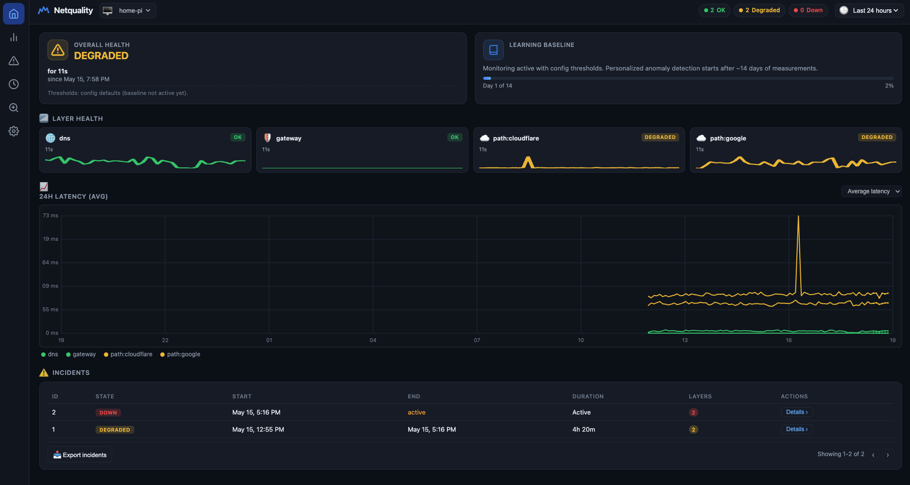

# Netquality

Single-binary home internet quality monitor for Linux (Raspberry Pi). Measures gateway ICMP, DNS, and HTTP/TCP path latency; tracks per-layer health states; records incidents with JSON export for ISP disputes.



## Features

- **Gateway probe** — ICMP to default router (LAN/CPE boundary)
- **DNS probe** — system resolver (+ optional explicit resolver)
- **Path probes** — HTTP HEAD or TCP connect to targets you configure
- **State machine** — `ok` / `degraded` / `down` per layer and overall, with debounce
- **Baselines** — after 14 days, learned hour-of-week p95 thresholds augment fixed YAML thresholds
- **Incidents** — append-only records with JSON export
- **Web UI** — embedded dashboard on configurable listen address

## Quick start (Raspberry Pi)

### Pre-built binaries (recommended)

1. Go to the [Releases](https://github.com/ebastos/netquality/releases) page and download the archive for your platform:
   - Linux arm64 (64-bit Pi OS / aarch64): `netqualityd_0.1.0_linux_arm64.tar.gz`
   - Linux armv7 (32-bit Pi OS / armv7l): `netqualityd_0.1.0_linux_armv7.tar.gz`
   - macOS Apple Silicon: `netqualityd_0.1.0_darwin_arm64.tar.gz`
   - macOS Intel: `netqualityd_0.1.0_darwin_amd64.tar.gz`
   - Linux amd64 / x86_64: `netqualityd_0.1.0_linux_amd64.tar.gz`
   - Windows: `netqualityd_0.1.0_windows_amd64.zip`

2. Extract and install:

```bash
tar -xzf netqualityd_0.1.0_linux_arm64.tar.gz   # or the matching file
sudo install -m 0755 netqualityd /usr/local/bin/
sudo setcap cap_net_raw+ep /usr/local/bin/netqualityd   # required for gateway ICMP
```

3. Continue with configuration and systemd setup below.

### Build from source

```bash
git clone https://github.com/ebastos/netquality.git
cd netquality
go build -o netqualityd ./cmd/netqualityd

sudo useradd -r -s /usr/sbin/nologin netquality 2>/dev/null || true
sudo mkdir -p /etc/netquality /var/lib/netquality
sudo cp deploy/config.example.yaml /etc/netquality/config.yaml
# edit /etc/netquality/config.yaml — set listen, targets, data_dir

sudo go build -o /usr/local/bin/netqualityd ./cmd/netqualityd
sudo setcap cap_net_raw+ep /usr/local/bin/netqualityd
sudo chown netquality:netquality /var/lib/netquality

sudo cp deploy/netqualityd.service /etc/systemd/system/
sudo systemctl daemon-reload
sudo systemctl enable --now netqualityd
```

Open `http://127.0.0.1:8080` (or your configured `listen` address).

### Cross-compile from another machine

```bash
make build-pi   # builds both armv7 and arm64 binaries
```

On the Pi, check architecture and copy the matching binary:

```bash
uname -m
# armv7l  → use bin/netqualityd-linux-armv7   (32-bit Raspberry Pi OS)
# aarch64 → use bin/netqualityd-linux-arm64   (64-bit Raspberry Pi OS)
```


`Exec format error` means the binary architecture does not match the OS (e.g. arm64 binary on 32-bit `armv7l`).

## Configuration

See [deploy/config.example.yaml](deploy/config.example.yaml).

| Key | Description |
|-----|-------------|
| `listen` | HTTP bind address (`127.0.0.1:8080` or LAN) |
| `data_dir` | SQLite database directory |
| `gateway.enabled` | ICMP to default gateway |
| `dns.query_host` | Hostname for DNS latency test |
| `targets` | Path probes (HTTP or TCP) |
| `baseline.warmup_days` | Days before anomaly baselines apply |
| `retention.*` | Raw sample and rollup retention |

## ICMP permissions

Gateway probing requires raw ICMP. Either:

- `AmbientCapabilities=CAP_NET_RAW` in systemd (see [deploy/netqualityd.service](deploy/netqualityd.service)), or
- `sudo setcap cap_net_raw+ep /usr/local/bin/netqualityd`

## Measurement placement

For ISP-faithful results, run the Pi with **wired Ethernet** to your primary router, same guidance as typical home monitoring setups.

## API

| Endpoint | Description |
|----------|-------------|
| `GET /` | Web dashboard |
| `GET /api/v1/status` | Current dimension states, `baseline_mode`, `warm`, and `learning` progress while warming up |
| `GET /api/v1/incidents` | Incident list |
| `GET /api/v1/incidents/{id}/export` | Evidence JSON download |
| `GET /api/v1/rollups?since=` | 5-minute rollups for charts |

## Development

```bash
go test ./...
go vet ./...
NETQUALITY_CONFIG=deploy/config.example.yaml go run ./cmd/netqualityd
```

Use a writable `data_dir` in config when developing locally (e.g. `./data`).

## License

MIT
